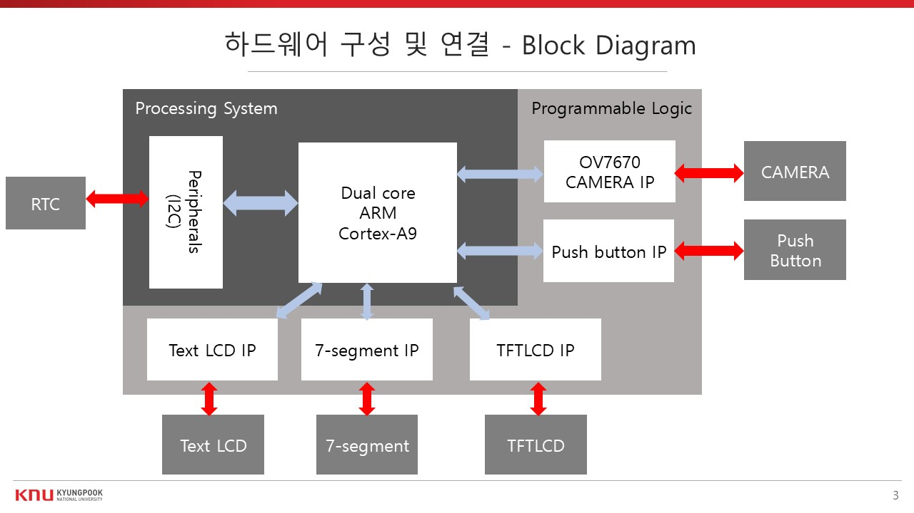
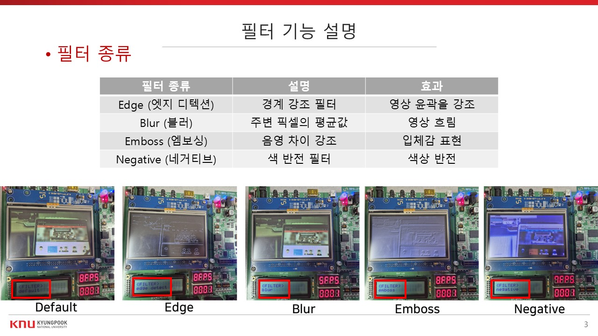

# 📸 ZYNQ 스마트 카메라
ITEC412/SoC 설계 및 프로그래밍 프로젝트 

---

## 📌 프로젝트 개요

본 프로젝트는 **실시간 카메라 영상에 다양한 필터를 적용하고**, 버튼을 이용해 사진을 촬영하여 **SD 카드에 저장**하는 스마트 카메라 시스템을 구현하는 것을 목표로 합니다.

---

## 🎯 주요 기능

- 실시간 영상 입력 및 TFT LCD 출력
- 버튼을 이용한 필터 선택 및 사진 촬영
- SD 카드에 필터 적용된 이미지 저장
- Text LCD 및 7-Segment를 이용한 시스템 상태 표시
- 제작자 모드 및 갤러리 모드 지원

---

## 🧩 시스템 구성도

### 📷 하드웨어 구성 (Block Diagram)

- **Processing System (PS)**: Dual-core ARM Cortex-A9
- **Programmable Logic (PL)**:
  - Camera IP (OV7670)
  - TFT LCD IP
  - Push Button IP
  - Text LCD IP
  - 7-segment IP

### 📸 Camera IP 동작

1. PL에서 SCCB 통신으로 카메라 초기화
2. 입력 영상 데이터를 BRAM에 저장
3. AXI4-Lite 인터페이스를 통해 PS로 전송

---

## 🧠 소프트웨어 구조

### 📱 메인 화면

| 모드 | 설명 |
|------|------|
| 카메라 모드 | 실시간 영상 출력, 필터 선택, 사진 촬영 |
| 갤러리 모드 | SD 카드에 저장된 사진 탐색 |
| 제작자 보기 | 시스템 및 필터 정보 확인 |

### 🖼️ 필터 기능

- Edge
- Blur (SIMD 적용)
- Emboss
- Negative

### 💾 저장 정보

- 누적 사진 수 (7-Segment 표시)
- 현재 적용 필터
- 프레임 수
- 현재 시간 워터마크

---

## ⚡ 소프트웨어 최적화

- **SIMD 기반 Blur 필터 적용**
  - Line buffer와 NEON 연산을 통해 6FPS → 8FPS로 성능 향상
  - `uint16x8_t` SIMD 타입 사용

---

## 🎥 시연 영상

## ❓ Q&A

궁금한 점은 Issue 또는 Discussions에 남겨주세요!
